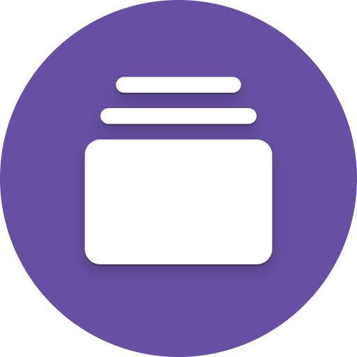
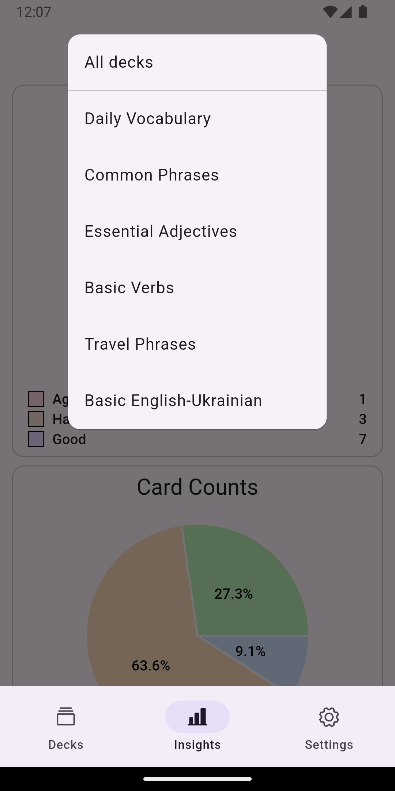
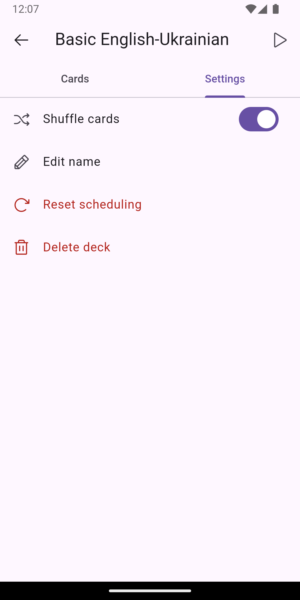

    

# Flanki

Flanki is an open-source, cross-platform spaced repetition application 📚✨ designed to help users effectively memorize information.

## Features :fire:
- [x] Create and manage decks 📚
- [x] Add and organize cards 🃏
- [x] Use the SM2 algorithm for better memorization ⏳
- [x] Track your progress with simple stats 📊
- [x] Customize language and theme options 🌐
- [x] Fast and responsive user experience 🚀

## Screenshots :iphone:

    
    
    
    
    
    
    
    
    
    
    

## Installation :hammer_and_wrench:
1. Clone repository `git clone https://github.com/fleetby/flanki.git`
2. Navigate to the project directory
3. Install the required dependencies: `flutter pub get`
4. Run the app: `flutter run`

## Contributing :handshake:
Contributions to Flanki are welcome! This application aims to create a simple and effective spaced repetition tool that supports various platforms. 🚀

If you have suggestions or feedback to help enhance the app or improve practices, please feel free to submit a pull request or open an issue. Your insights are greatly appreciated!

## License :scroll:
This project is licensed under the [MIT License](./LICENSE).